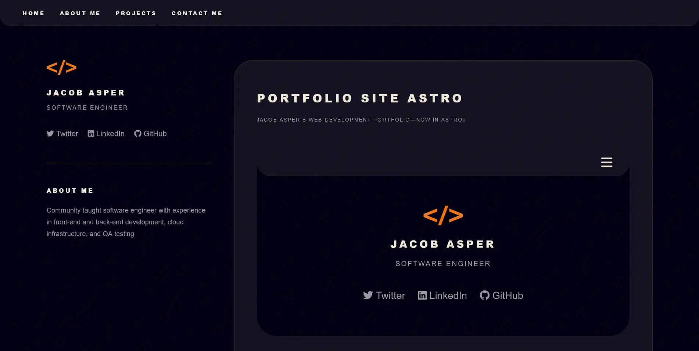

# Portfolio Site Astro

Jacob Asper's web development portfolio—now in astro!

[Live site](https://jacobasper.com/)

## Motivations

[My original portfolio](https://github.com/20jasper/portfolio-site) is built in pure HTML, CSS, and JavaScript, so as it grew, it became cumbersome to update. Once there were enough projects to warrant pagination, not only did I need to move all the projects to across pages manually, I needed to create a new form in Netlify for each page.

Migrating to [Astro](https://astro.build/) will help quite a bit with these issues since it offers built in pagination and components. The cherry on top is that astro uses SSG, so there won't be any performance cost!

## How It's Made

**Tech used:** HTML, CSS, TypeScript, Astro

I started with my original portfolio site, and slowly started to convert it into components. Along the way, I removed unused CSS, improved accessibility, and reduced redundancy with loops.

<!--
## Optimizations

_(optional)_

You don't have to include this section but interviewers _love_ that you can not only deliver a final product that looks great but also functions efficiently. Did you write something then refactor it later and the result was 5x faster than the original implementation? Did you cache your assets? Things that you write in this section are **GREAT** to bring up in interviews and you can use this section as reference when studying for technical interviews!

## Lessons Learned:

No matter what your experience level, being an engineer means continuously learning. Every time you build something you always have those _whoa this is awesome_ or _fuck yeah I did it!_ moments. This is where you should share those moments! Recruiters and interviewers love to see that you're self-aware and passionate about growing.
-->
